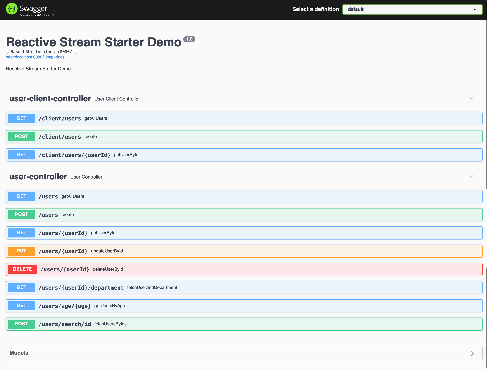

# spring-boot-webflux-reactive-rest-api-example

# Sample Reactive - Spring Boot application

The purpose of this project is to demonstrate how we can
use [Spring WebFlux](https://docs.spring.io/spring/docs/current/spring-framework-reference/web-reactive.html) to create
a simple reactive web application.

This project uses [PostgreSQL](https://github.com/r2dbc/r2dbc-postgresql) implementation of the R2DBC SPI.

## Tech stack

| Component     | Version                                            |
|---------------|----------------------------------------------------|
| Java          | 25                                                 |
| Spring Boot   | 4.1.1                                              |
| Spring WebFlux| reactive web stack (Netty)                          |
| Spring Data   | R2DBC (`r2dbc-postgresql`, `r2dbc-h2` for tests)    |
| PostgreSQL    | 17 (via `compose.yml`)                              |
| springdoc     | 3.1.0 (OpenAPI 3 / Swagger UI)                      |
| Lombok        | boilerplate reduction                               |

# How to build and run

project can be compiled with JDK 25 `javac`.

To compile just do `./mvnw clean package`.

## Prerequisites

* JDK 25 should be installed
* Docker (recommended), or a PostgreSQL instance you start yourself

### Database

The project ships a `compose.yml` with a PostgreSQL service, and
`spring-boot-docker-compose` is on the runtime classpath — so when Docker is running, Spring Boot
starts the container on startup and wires the R2DBC connection details automatically:

```
docker compose up -d
```

The container publishes PostgreSQL on host port `5433` (database `reactive`, user `hendisantika`,
password `53cret`), which is what the `dev` profile connects to — so the application also works
against the container when Docker Compose support is switched off
(`spring.docker.compose.enabled=false`) and you start it yourself. If you prefer to run your own
PostgreSQL, override `spring.r2dbc.*` in `application.yml` or via environment variables to point
somewhere else.

Tables are created on every startup from `src/main/resources/schema.sql`, and `UserInitializer`
seeds sample users and departments.

### Profiles

| Profile | Database                                  |
|---------|-------------------------------------------|
| `dev`   | PostgreSQL at `localhost:5433` (default)  |
| `test`  | in-memory H2 (no seeding)                 |
| `prod`  | PostgreSQL at `localhost:5432`            |

To run the application execute the following:

```
java -jar target/webflux-reactive-rest-api-example*.jar
```

or, during development:

```
./mvnw spring-boot:run
```

You can also use the Swagger-UI to test the application.


for more detailed technical information please check the article
post : <https://dassum.medium.com/building-a-reactive-restful-web-service-using-spring-boot-and-postgres-c8e157dbc81d>

The server will start at <http://localhost:8080>.

## Exploring the Rest APIs

The Swagger UI will open at : <http://localhost:8080/swagger-ui> and the OpenAPI document is served
at <http://localhost:8080/v3/api-docs>.

The application contains the following REST APIs

```
1. GET    /users                     - Get all users

2. POST   /users                     - Create a user

3. GET    /users/{userId}            - Retrieve a user by id

4. PUT    /users/{userId}            - Update a user

5. DELETE /users/{userId}            - Delete a user

6. GET    /users/age/{age}           - Get users aged {age} and above

7. POST   /users/search/id           - Fetch users for a JSON array of ids, e.g. [1,2,3]

8. GET    /users/{userId}/department - Fetch a user together with their department
```

It contain a sample WebClient to retrieve data from our User Management application. `UserClient`
calls the endpoints above over HTTP and is exposed through a second controller:

```
1. GET    /client/users              - Get all users through the WebClient

2. GET    /client/users/{userId}     - Retrieve a user by id through the WebClient

3. POST   /client/users              - Create a user through the WebClient
```

## Running the tests

```
./mvnw test
```

The tests run against an in-memory H2 database, so no PostgreSQL instance is required.
